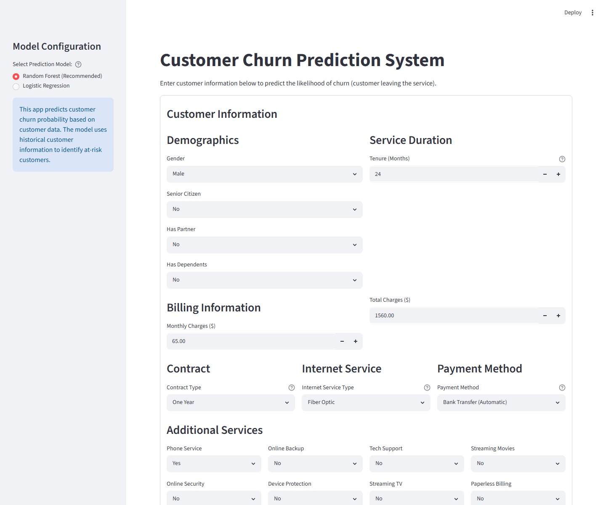
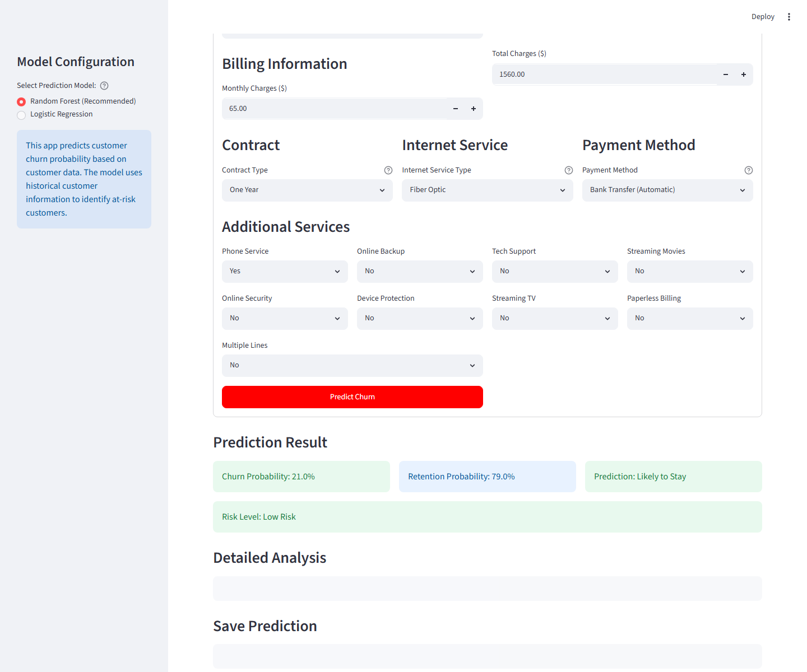
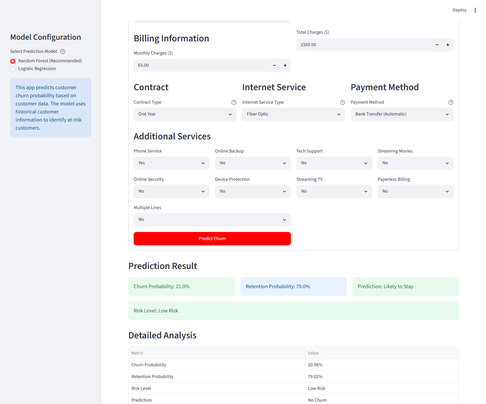

# Telco Customer Churn Analysis & Prediction

Machine learning project for analyzing telecom customer churn and predicting which customers are likely to leave. The repository includes the original analysis notebooks, prepared datasets, a repeatable model-training script, and a Streamlit prediction app.


## Project Overview

The goal is to identify customers at risk of churn so retention teams can act earlier. The workflow covers:

1. Data understanding and cleaning
2. Exploratory data analysis
3. Feature engineering
4. Logistic Regression and Random Forest modeling
5. Model evaluation
6. Business recommendations
7. Interactive churn prediction with Streamlit

## App Preview







## Dataset

- Source: [Kaggle - Telco Customer Churn](https://www.kaggle.com/blastchar/telco-customer-churn)
- Rows after cleaning: 7,032
- Features: 24 model-ready features
- Target: `Churn` (`No` or `Yes`)

## Key Findings

- About 26.5% of customers churned, so churn recall matters more than accuracy alone.
- Higher-risk segments include month-to-month contracts, low-tenure customers, electronic check users, and customers without support/security add-ons.
- Random Forest is the recommended app model because it achieved the strongest test accuracy and churn detection balance in this project.

## Model Performance

| Metric | Logistic Regression | Random Forest |
| --- | ---: | ---: |
| Accuracy | 72.57% | 77.26% |
| Churn recall | 80% | 73% |
| Best use | Baseline/interpretable model | Primary retention model |

Although Logistic Regression achieved higher churn recall, Random Forest was selected as the primary app model because it provided stronger overall accuracy and a better balance between churn detection and general prediction performance.

## Quick Start

```bash
pip install -r requirements.txt
python models/train_and_save_models.py
streamlit run apps/prediction.py
```

The app opens at `http://localhost:8501`.

Windows users can also run:

```bash
run_app.bat
```

Mac/Linux users can run:

```bash
bash run_app.sh
```

## Streamlit App Features

- Choose between Random Forest and Logistic Regression
- Enter customer demographics, billing, contract, and service details
- View churn probability, retention probability, and explicit risk level
- See clear Low Risk, Medium Risk, and High Risk styling
- Download a prediction as CSV
- Automatically log predictions to `data/predictions_log.csv`

## Repository Structure

```text
.
|-- apps/
|   |-- __init__.py
|   |-- prediction.py
|   |-- utils.py
|   `-- README.md
|-- assets/
|   `-- screenshots/
|-- data/
|   |-- churn_raw.csv
|   |-- cleaned_dataset_for_EDA.csv
|   |-- data_for_model_building.csv
|   |-- predictions_log.csv
|   `-- train_test_splits.pkl
|-- models/
|   |-- feature_names.pkl
|   |-- logistic_regression_model.pkl
|   |-- random_forest_model.pkl
|   |-- scaler.pkl
|   `-- train_and_save_models.py
|-- notebooks/
|   |-- 1_data_understanding.ipynb
|   |-- 2_data_cleaning.ipynb
|   |-- 3_EDA_analysis.ipynb
|   |-- 4_feature_engineering.ipynb
|   |-- 5_model_building.ipynb
|   |-- 6_model_evaluation.ipynb
|   `-- 7_business_recommendations.ipynb
|-- requirements.txt
|-- run_app.bat
|-- run_app.sh
|-- .gitignore
`-- README.md
```

## Model Artifacts

The repository includes trained model artifacts in `models/` so the Streamlit app can run immediately after installation:

```text
logistic_regression_model.pkl
random_forest_model.pkl
scaler.pkl
feature_names.pkl
```

Recreate them anytime with:

```bash
python models/train_and_save_models.py
```

## Troubleshooting

If the app says model artifacts are missing, run:

```bash
python models/train_and_save_models.py
```

If Streamlit is missing, run:

```bash
pip install -r requirements.txt
```